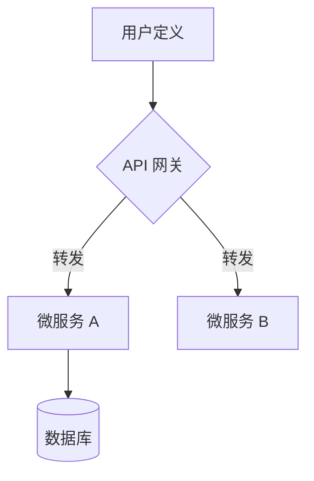
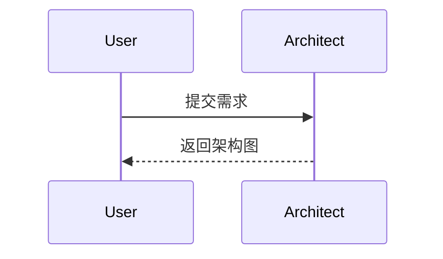

# Skill: Mermaid 图表绘制专家

当你被要求绘制架构图、流程图或时序图时，请激活此技能。

## 1. 绘图准则
- **自顶向下**：流程图优先使用 `TD` (Top Down) 方向。
- **正交布局**：尽量减少连线交叉。
- **美化节点**：为不同类型的节点（如数据库、缓存、外部 API）使用不同的形状或颜色。
- **自包含**：确保代码块以 ```mermaid 开头，以 ``` 结尾。

## 2. 常用模版

### 模块依赖图 (Flowchart)



### 时序图 (Sequence Diagram)



## 3. 输出要求

在输出 Mermaid 代码后，请简要说明图中各关键节点的含义。
